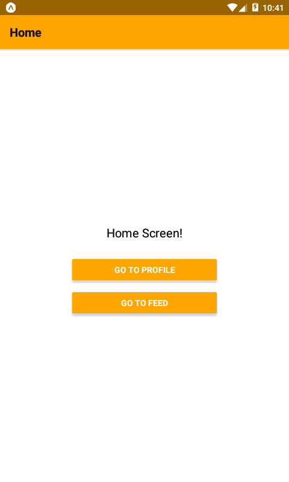

# :books: react-navigation-example

React native navigation app example for Android using Expo.

## :hammer: Setup

```bash
# clone mapview-mapbox project
git clone git@github.com:philwamba/react-navigation-example.git

# open project directory
cd react-navigation-example

# install dependencies
yarn install

# run the project
expo start
```

## :paperclip: Screenshots (3)



